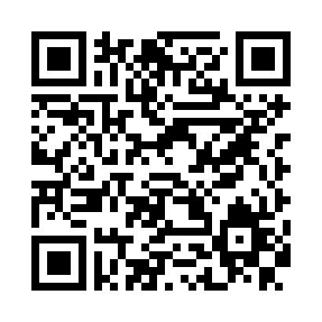

# BarOrder Android

Attenzione!!! Applicazione è in lingua italiana.

Applicazione Android che permette di usare il servizio [BarOrder](https://github.com/therickys93/barorder.git). Questa applicazione è pensata per il datore di lavoro e i suoi dipendenti, una possibile applicazione per i clienti potrà essere rilasciata in seguito.

## Installazione

* Per installare la app cliccare [qui](https://github.com/therickys93/BarOrderAndroid/releases/latest) oppure fare lo scan del qr code sottostante

* aperto il link verrà mostrata una pagina dove all'interno della pagina c'è un file che si chiama: "app-release.apk", cliccate su quel file e si avvierà il download in automatico
* finito il download, aprite il file appena scaricato e vi verrà chiesto se volete installarlo e seguite la procedura guidata

## Configurazione

* La prima volta che aprite l'applicazione dovete configurarla, per far questo cliccate sui 3 puntini in alto a destra e cliccate su impostazioni
* nella prima casella dovete mettere l'indirizzo ip del server BarOrder e nella seconda il numero di tavoli
* Ora siete pronti per usarla